# 1️⃣ 깃허브 기초 (1)

첫 주차에서는 일단 따라해볼게요.   
지금은 영문을 모른채 따라하더라도, 다음 주차들에서는 비슷한 과정을 계속 반복하기 때문에, 스터디가 끝난 후에는 깃허브에 익숙해져 있을 거에요. 

## 학습목표
> ### 전체
> [HeoJiye/Github-Study](https://github.com/HeoJiye/Github-Study) 레포지터리에 본인 수정 사항을 전달해보는 과정을 경험해본다.  
>
> ### 개발자들 
> git의 기능들 `fork`, `clone`, `commit`, `push`, `pull request`를 사용해서 깃허브 기초 사용법을 익혀본다.

[Git이 뭔지, Fork가 뭔지.. 에 대한 것은 여기에](./github-basic-zip.md)

[기획자/디자이너분들은 여기로 바로](#기획자디자이너-루트)

## 개발자 루트
### 1. git을 다운로드한다.
[git 설치법](https://shxrecord.tistory.com/115?category=677810)

터미널 사용이 꺼려진다면 깃허브 데스크탑을 사용해도 좋습니다. (뒤 설명은 git 터미널 사용 기준입니다.)
[깃허브 데스크탑 사용법](https://m.blog.naver.com/beaqon/221269438710)

### 2. Fork: 내 계정에 레포지터리를 만들어 가져오기
- 상단에 Fork 버튼을 클릭한다.  
    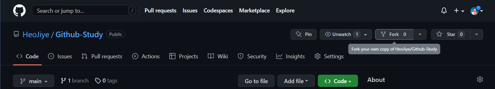

- create fork 버튼을 클릭한다.  
    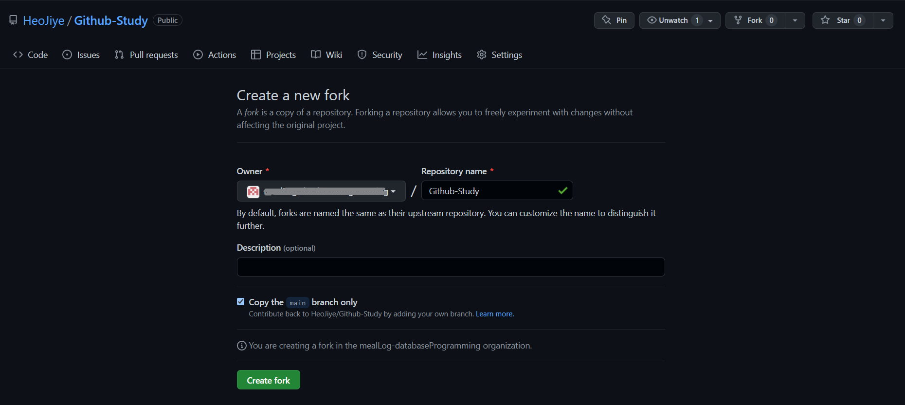
- **Fork 완료!**

### 3. Clone: 로컬 저장소에 가져오기
- 원하는 경로에 폴더를 생성한다.  
    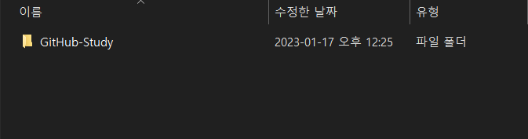
- 생성한 폴더를 우클릭하고 Git Bash Here을 선택한다.  
    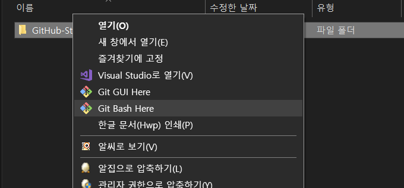
- 생성된 터미널에 다음과 같이 입력한다. **끝에 점(.)을 꼭 찍어주자**
    ```
    git clone <레포지터리 주소>.git .
    ```
    Ex. git clone https://github.com/(본인 계정)/Git-Study.git .

    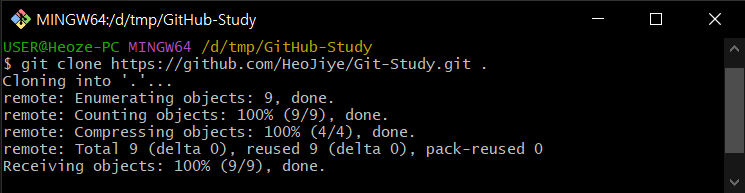

- **Clone 완료!**

### 4. Branch, Switch: 본인 브랜치를 생성하고 전환한다.
처음에는 `main` 브랜치로 설정되어 있을 텐데, 본인 깃허브 계정 이름으로 브랜치를 생성해서 작업하겠습니다.

- 브랜치 생성하기
    ```
    git branch <본인 계정 이름>
    ```
    - `git branch` 명령어로 브랜치 목록을 확인할 수 있습니다.
    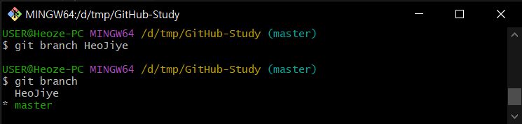
- 생성한 브랜치로 전환하기
    ```
    git switch <생성한 브랜치 이름>
    ```
    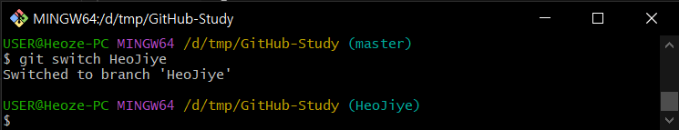
- **브랜치 생성과 전환 완료!**

### 5. 자기소개를 작성해본다.
- 본인 학번으로 폴더를 생성한다  
    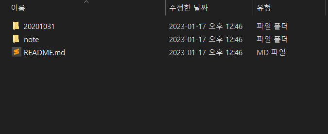
- 폴더 안에 자유롭게 자기 소개를 작성한다.  
    - txt 파일 생성해서 작성하기  
    - markdown을 이용해 작성하기 (폴더안에 이미지 자유롭게 업로드 가능)  
        - [markdown 작성법](https://gist.github.com/ihoneymon/652be052a0727ad59601)
    - html 사용해서 웹페이지로 작성 등등

### 6. Add: 작성한 파일 업로드할 준비하기 
- 생성한 폴더를 통째로 스테이징한다.
    ```
    git add <본인 학번>
    ```
    - `git status` 명령어로 스테이징 현황을 확인할 수 있습니다.
    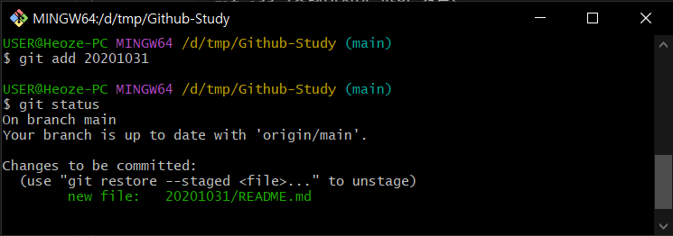
- **작성한 파일 스테이징 완료**

### 7. Commit: 현재 버전 저장하기
- `git commit` 명령어를 이용해 커밋 생성하기
    ```
    git commit -m "<이름> 자기소개 작성"
    ```
    - `git log -1` 명령어로 커밋 한 개를 확인할 수 있습니다.
    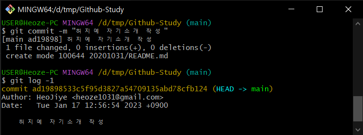

### 8. Push: 지금까지의 커밋들 Github에 올리기
- 'git push' 명령어를 이용해 지금까지의 커밋을 github에 올립니다.
    ```
    git push origin <브랜치 이름>
    ```

### 9. Pull request: 원본 저장소에 수정 사항 적용 요청하기
- 본인 계정의 레포지터리의 본인 이름의 브랜치에서 Contribute > Create Pull request 클릭
 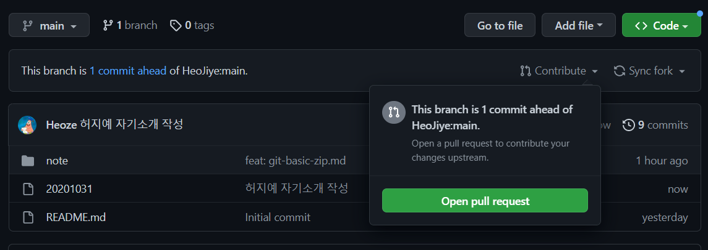

- 이후 창에서 Create pull request 버튼 클릭 

 - **pull request를 완료하면 과제 제출 완료!**

## 기획자/디자이너 루트

### 1. Fork: 내 계정에 저장소를 만들어 가져오기
- 상단에 Fork 버튼을 클릭한다.
    

- create fork 버튼을 클릭한다.
    
- **Fork 완료!**

### 2. 파일 수정하기
- 본인 계정의 저장소에서 Add file > Create new file 클릭
    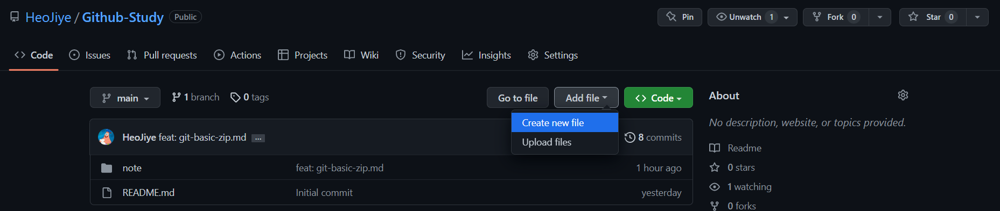
- 파일 명을 본인 학번으로 하고, 자기소개를 자유롭게 작성
    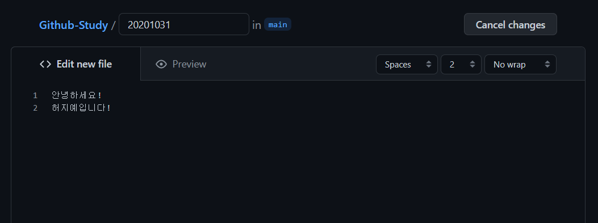
- 하단에 커밋 메세지를 '(본인 이름) 자기소개 작성'이라고 입력하고 Commit new file 버튼 클릭
    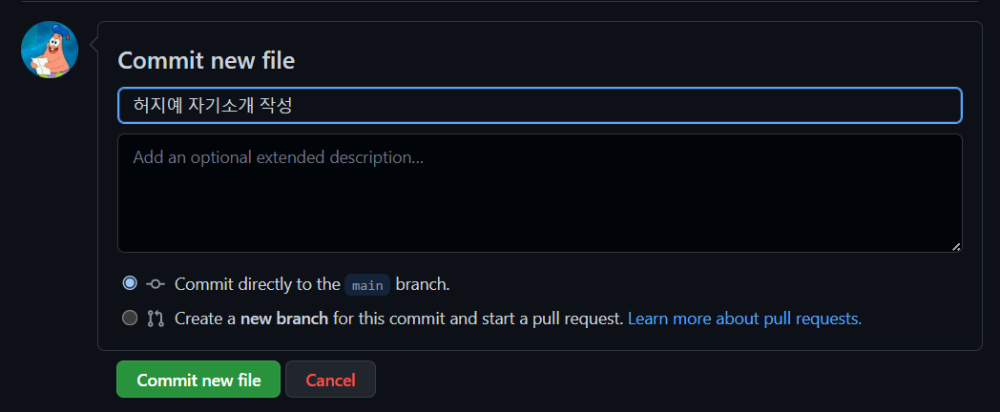  

### 3. 과제 제출
- 본인 계정의 저장소에서 Contribute > Open Pull request 클릭
 

- 이후 창에서 Create pull request 버튼 클릭 

 - **pull request를 완료하면 과제 제출 완료!**