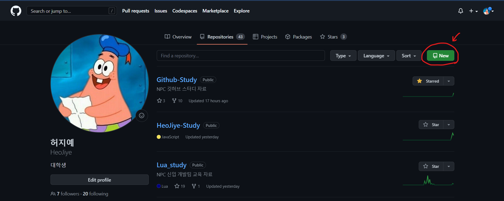
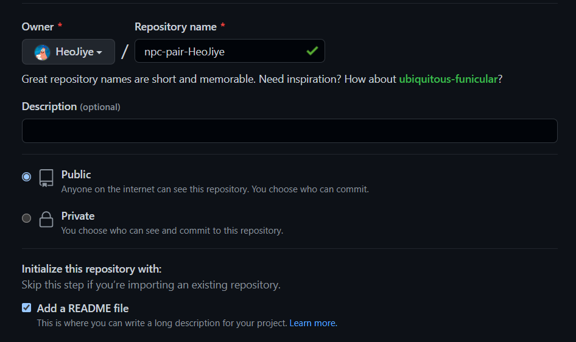
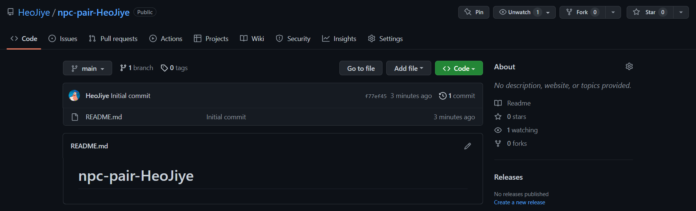
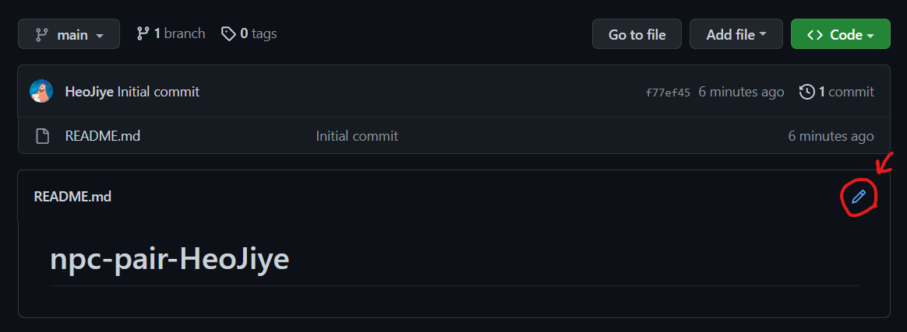

# 2️⃣ 깃허브 기초 (2)

깃허브 기초 (2) 단계는 2주에 걸쳐서 진행됩니다.

## [이전 주차](./github-basic-1.md)에서는 
- [HeoJiye/Github-Study](https://github.com/HeoJiye/Github-Study) 레포지터리를 본인 계정으로 `fork`한 뒤
- `clone`으로 로컬 저장소로 가져오고
- 자기소개를 작성하여 수정한 뒤, 수정 사항을 `commit`하고
- 커밋한 내용을 본인 계정 레포지터리에 `push`하고
- 본인 계정 레포지터리의 커밋들을 [HeoJiye/Github-Study](https://github.com/HeoJiye/Github-Study) 레포지터리에 적용하기 위해 `pull request`를 해서 과제를 제출했습니다.

[각 용어에 대한 설명은 여기로](./github-basic-zip.md)

 

많이 복잡했죠? 영문을 모른 채 따라왔어도 괜찮아요.  
기본적인건 거의 이미 한 번씩 해봤기 때문에, 앞으로는 했던 것을 계속 반복하면서 깃허브에 익숙해져볼게요.

스터디에서는 헤매도 좋고, 수정한 것들을 다 날려버리는 실수를 해도 좋으니까 일단 부딪혀보고 질문이 있다면 [질문 게시판](https://github.com/HeoJiye/Github-Study/discussions)에 글도 올리면서 깃허브에 익숙해져봐요!

 

## 학습목표
> ### 전체
> 깃을 활용해서 짝끼리 교환일기를 작성해본다.  
> 
> ### 개발자들은
> 1. 이전 주차에 학습했던 `fork`, `clone`, `commit`, `push`, `pull request`를 다시 사용해본다.
> 2. `remote`를 사용해서 내 계정에 레포지터리를 생성해본다. 
> 3. `pull`을 사용해서 다른 사람의 커밋을 내 계정의 레포지터리에 받아와본다. 

 

## 첫 번째 주차
- 목표 1: 본인 계정에 레포지터리를 생성하고, `commit`을 1회 이상 한다.
- 목표 2: 짝꿍의 계정 레포지터리를 `fork`해서 1회 이상 `commit` 후, `pull request`를 보낸다. 

### 본인 계정에 레포지터리 생성 후 commit하기
- 본인 프로필 Repositories 탭에서 레포지터리 생성 버튼 `New`을 클릭한다.
    

 

- 레포지터리 이름은 'npc-pair-`본인 계정 이름`'으로 설정합니다.
- 공개 범위는 후에 수정하더라도, 과제 제출 확인을 위해 `public`으로 설정합니다.
- Add a README file을 체크합니다.
    

 

- 레포지터리가 생성되었습니다.
- (to. 개발자들) README 파일을 생성하지 않으려면, 로컬에서 깃허브 레포지터리를 생성하고 remote로 깃허브 레포지터리에 연결해서 생성하면 됩니다. [관련 블로그글 참고](https://velog.io/@falling_star3/GitHub-Git-Repository-%EC%83%9D%EC%84%B1-%EB%B0%8F-git-init%EC%9C%BC%EB%A1%9C-%EB%A1%9C%EC%BB%AC-%EC%97%B0%EB%8F%99%ED%95%98%EB%8A%94-%EB%B0%A9%EB%B2%95%EB%A1%9C%EC%BB%AC-%EA%B9%83%ED%97%88%EB%B8%8C)
    

 

- 깃허브 레포지터리의 **README.md**를 수정해 첫 교환일기를 작성합니다.
    - 디자이너/기획자: 깃허브에서 바로 수정 버튼을 눌러 수정합니다.
    
    - 개발자: [깃허브 기본 명령어 참고](./github-basic-zip.md#git-기본-명령어)해서 진행 (이전 주차에 진행했던 것과 거의 동일)
        + 깃허브 레포지터리를 해당 폴더에 가져오기
        + REAMD.md 수정
        + 커밋할 데이터 등록하기(스테이징)
        + 커밋하기
        + 로컬 레포지터리의 변경사항 업로드하기(push)

 

- 쓸 거리 추천 (아무거나 쓰세요)  
    + 이름, 학번, 학과, 소속팀 등 본인 소개
    + npc 동아리에 어떻게 들어오게 됐는지
    + 이번 주말에 한 일
    + 학교 맛집 추천
    + 짝꿍에게 궁금한 것

### 짝꿍의 레포지터리 fork해와서 수정 후, pull request 보내기
- 이전 주차와 동일하게 fork해서 수정 commit 후, pull request를 합니다.
    + 다음 사항은 본인이 판단해서 진행합니다. (무엇이든 상관없어요)
        + 본인 이름으로 브랜치를 새로 생성해서 할 지, main 브랜치에서 할지
        + 커밋 메세지를 무엇으로 남길 지

## 두 번째 주차
- (추가 예정)