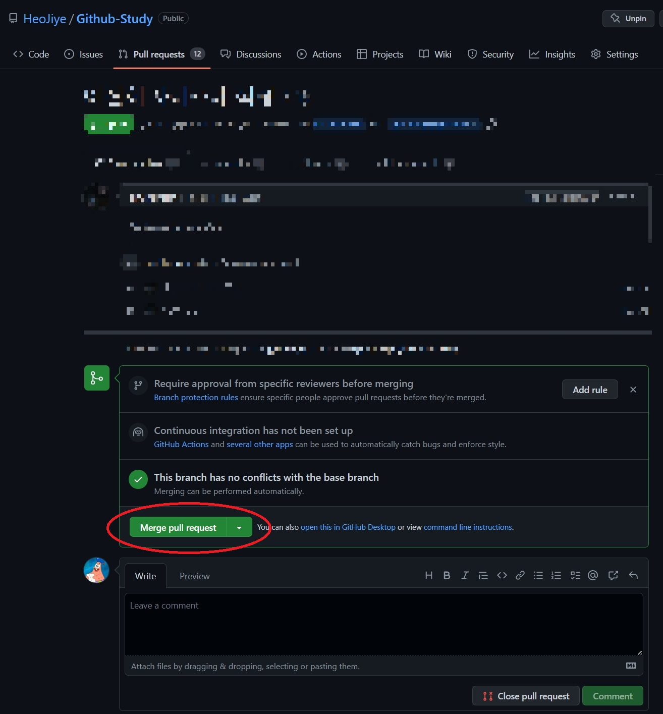
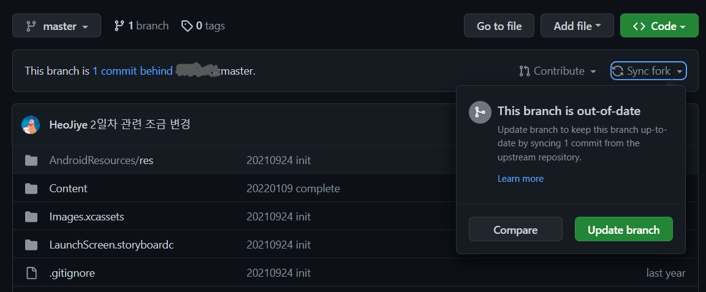

# 3️⃣ 짝꿍과 함께하는 깃허브 기초 - 2

## 두 번째 주차
- 두 번째 주차 진행 조건
    + 각자의 깃허브 레포지터리가 생성되어 있고, 수정 후 짝꿍의 레포지터리에 pull request를 보냈다.  

    만약 이 부분이 완성되어있지 않다면, 먼저 조건을 맞추고 다음 과제를 진행합니다. 

<br>

**공통 목표**
- 목표 1: `merge pull request`를 하여 다른 사람의 수정 사항을 내 레포지터리에 적용해본다. 
- 목표 2: `Sync fork`를 이용해 원본 레포지터리의 수정사항을 포크한 레포지터리로 가져와본다.

**개발자**
- (추가) 깃허브 레포지터리의 커밋을 로컬 레포지터리로 가져오기 위해 `pull`과 `patch`를 각각 사용해본다.

<br>

### 개발자 진행 방법
- **(주의)** `merge pull request` 하기 전, 이전에 생성한 레포지터리가 로컬에 없다면 clone 명령어로 가져오세요.

- **본인 레포지터리**에서 pull request 탭에 들어가 짝꿍이 보낸 pull request를 `merge pull request`를 한다.
    
    
    이후 레포지터리에 짝꿍의 수정 사항이 잘 적용이 되었는지 확인해보세요.

- 로컬에서 본인 레포지터리를 한번 더 수정 후, `commit`까지 합니다. 이때 로컬에서는 짝꿍의 수정 사항이 적용되지 않은 상태입니다.

<br>

> 여기서부터는 다음 부분을 참고해서 진행합니다.
> 
> [깃 기본 명령어 정리](https://github.com/HeoJiye/Github-Study/blob/main/note/github-basic-zip.md#git-%EA%B8%B0%EB%B3%B8-%EB%AA%85%EB%A0%B9%EC%96%B4)에서 **깃허브 레포지터리의 변경사항 가져오기(pull)** 부분

- 짝꿍의 수정사항을 로컬에 받아오기 위해 다음을 시도해보세요.
    ```
    git pull origin
    ```
    + **실패!**  
    `pull`은 병합과 동시에 수정사항 받아오는 명령어입니다.   
    짝꿍과 내가 동시에 같은 파일을 수정했기 때문에 충돌이 나, pull이 실패하게됩니다.

<br>

- **(미션!)** [깃 기본 명령어 정리](https://github.com/HeoJiye/Github-Study/blob/main/note/github-basic-zip.md#git-%EA%B8%B0%EB%B3%B8-%EB%AA%85%EB%A0%B9%EC%96%B4)의 `fetch` 부분을 참고해서 fetch를 이용해 충돌을 해결해 보세요!

<br>

**+ pull도 사용해보기**  
- 짝꿍의 레포지터리도 이전 단계까지 진행되었다면, `Sync fork`을 이용해 **포크된 레포지터리**에 그 수정사항을 가져옵니다.

    다음에서 `Update branch`를 클릭합니다.
    

- 해당 레포지터리에서 이전 버전까지 있는 로컬 레포지터리에서 수정 커밋없이 git pull을 시도하면 충돌없이 성공합니다.

<br>

### 기획자/디자이너 진행 방법
- **본인 레포지터리**에서 `pull request` 탭에 들어가 짝꿍이 보낸 pull request를 `merge pull request`를 한다.
    
    
    이후 레포지터리에 짝꿍의 수정 사항이 잘 적용이 되었는지 확인해보세요.

- 본인 레포지터리를 한번 더 수정합니다. 그리고 짝꿍도 여기까지 진행하기까지 기다립니다.

- 짝꿍의 레포지터리도 이전 단계까지 진행되었다면, `Sync fork`을 이용해 **포크된 레포지터리**에 그 수정사항을 가져옵니다.

    다음에서 `Update branch`를 클릭합니다.
    